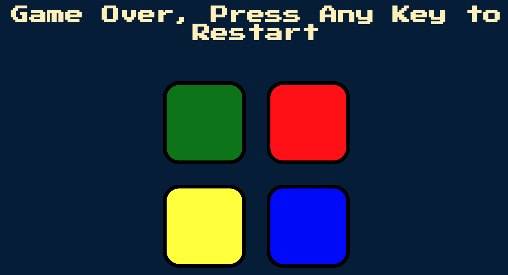
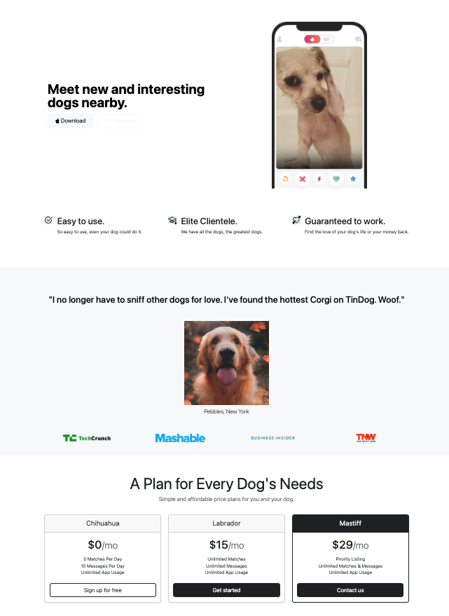
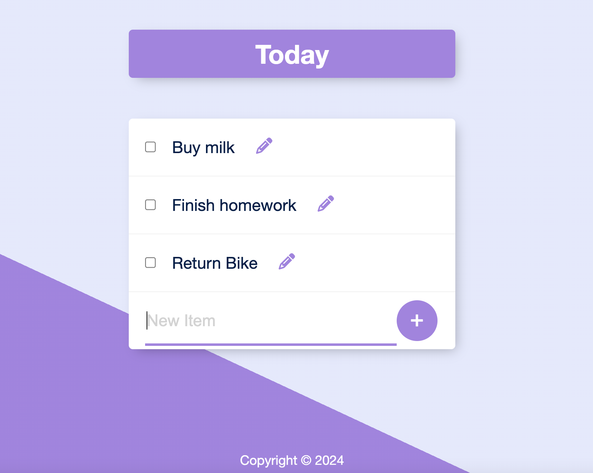
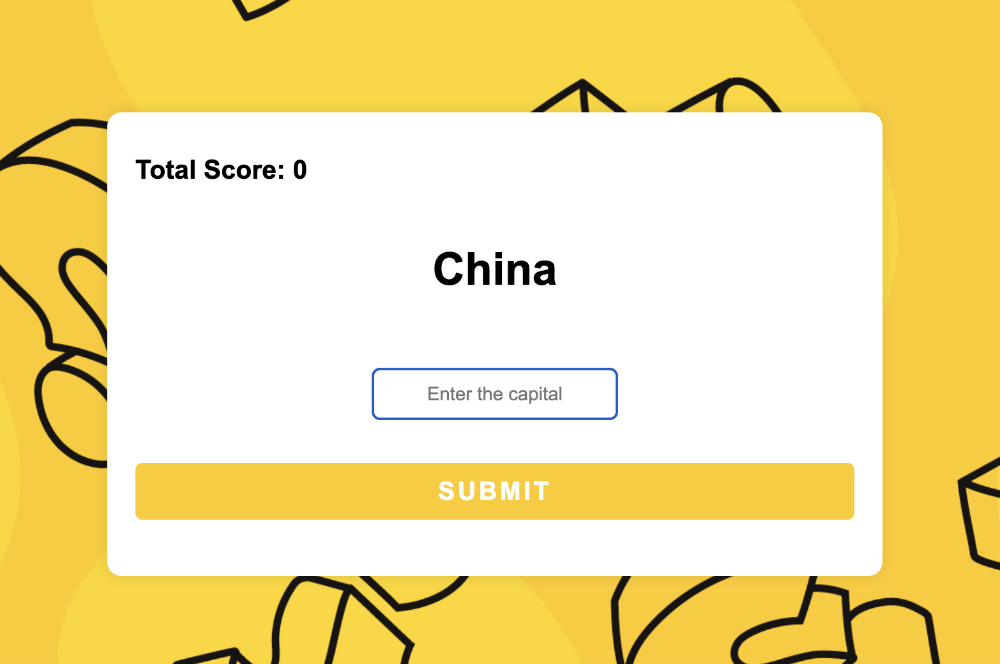
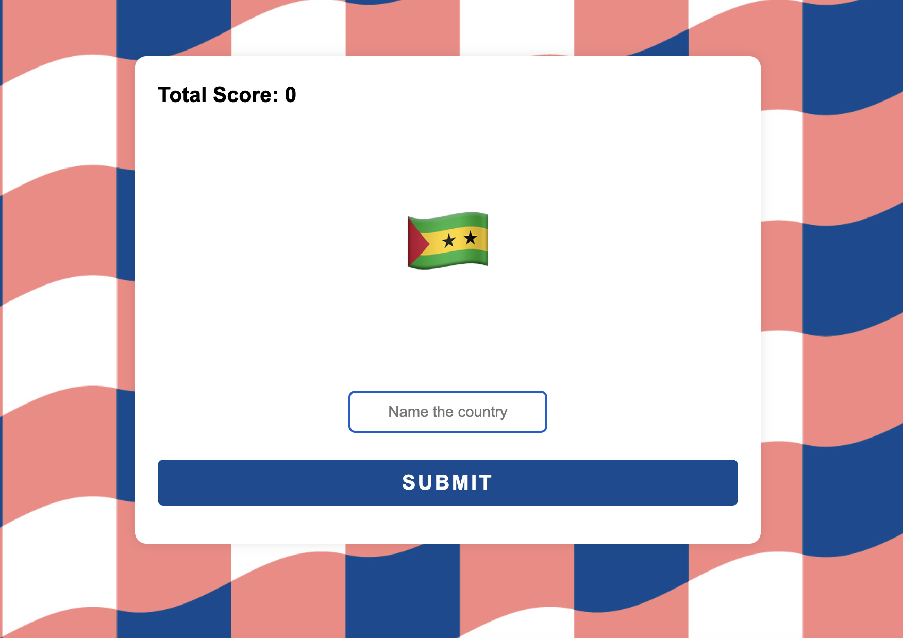
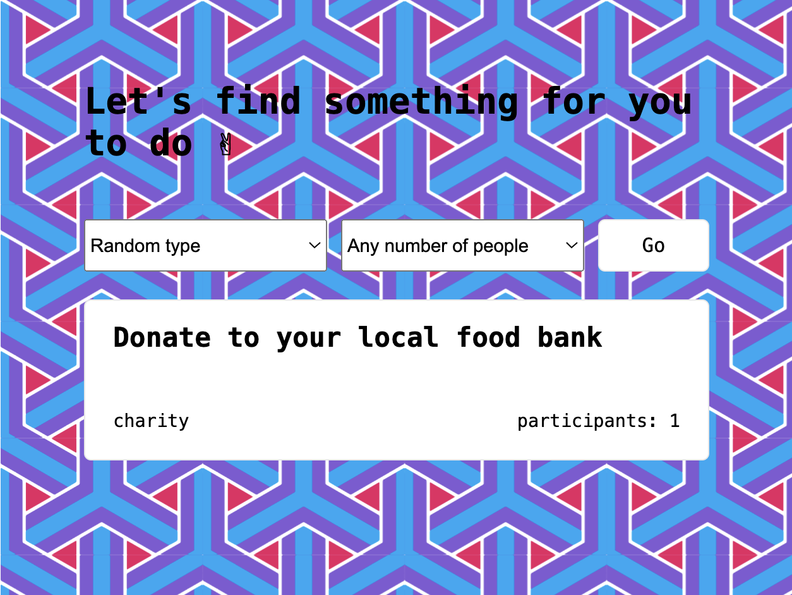
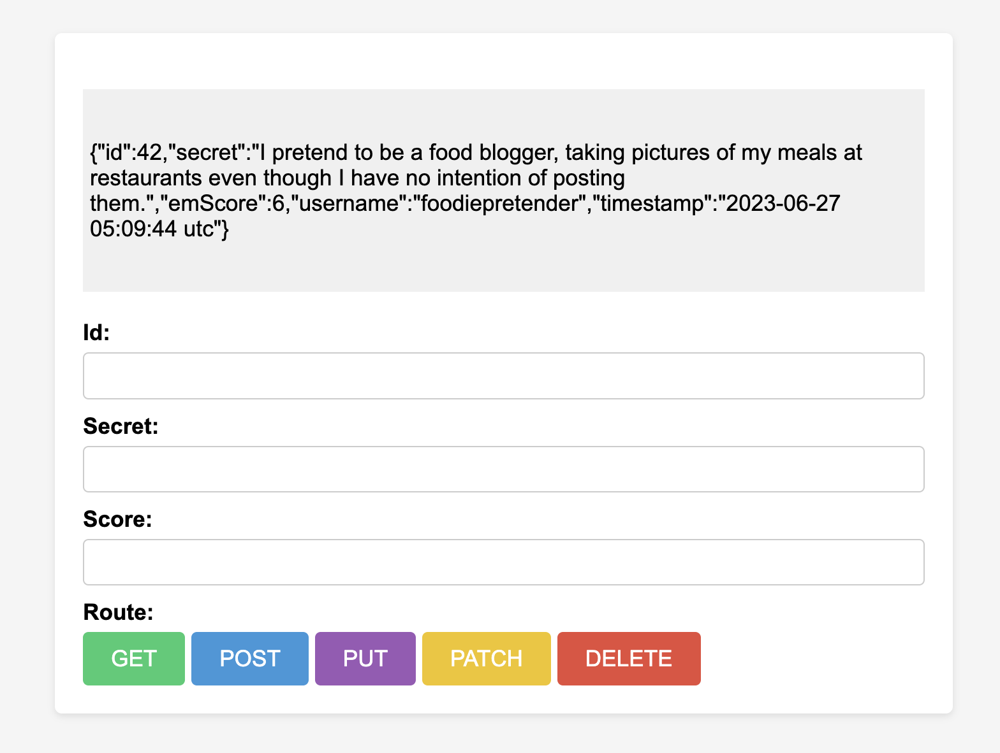

# The Complete 2023 Web Development Bootcamp
This repository is a collection of projects completed during the course of the Web Development Bootcamp Course prepared by [The App Brewery](https://appbrewery.com/).

## Projects Completed
### jQuery based Simon Game
  
This WebApp utilized jQuery 3.3.1 (with Googles' CDN) to actualize the "Simon" Board Game.
* * *
### Bootstrap-CSS-Project
  
This project utilizes Bootstrap CSS to visualize a dynamically resizable homepage to a Pet friend finder called "TinDog".
* * *
### PostgreSQL Projects
* Install dependencies:  
```
    npm i
```
* Execute Javascript source file:
```
    nodemon index.js
```

  
This is a Web App with Create, Read, Update, & Delete (CRUD) functionalities that is fully-persistant on a PostgreSQL Relational Database Management System. The relevant database was hosted locally using pgAdmin.   

This Web-App cross checks user input against a persistant Database against a Country-Capital Table. The number of correct user responses in a row are collected and displayed on the front-end. The game resets after a single incorrect response.  
  
This Web-App cross checks user input against a persistant Database against a Country-Flag Table. The number of correct user responses in a row are collected and displayed on the front-end. The game resets after a single incorrect response.  

* * *
### API Projects
  
Created a Web-App that suggests different activities based on type and number of individuals involved by connecting to the [Bored API](https://bored-api.appbrewery.com/) using Axios, a Promise-based HTTP Client used to make Server-side API requests.   
   
Created a RESTful Web-App that can handle all the necessary HTTP requests, ie; GET, POST, PUT, PATCH , DELETE by connecting to the [Secrets API](https://secrets-api.appbrewery.com/) via bearer token-based authentication (AUTH2.0).  
  
Created a Web-App that uses the `/random` endpoint of the [Secrets API](https://secrets-api.appbrewery.com/) to display randomly selected secrets submitted by the APIs users. This is application uses Axios to make concise requests and Express.js for the backend.